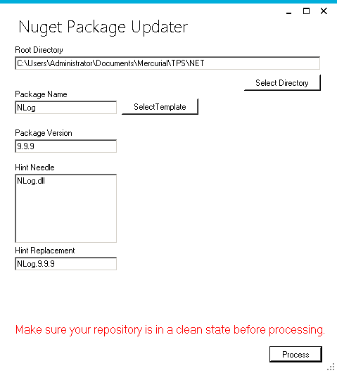

This tool allows you to update all packages.config and *.csproj files in a repository to use the same version of a nuget packages.

This is useful when you have 100 or more projects to update and you're not doing anything other than bumping a version.

This tool iterates all directories under the provided root directory looking for packages.config files and updates the version of the package you have supplied.

It then iterates all csproj files looking for the dll reference and updates what is between lib and packages in the path with the hintString. The hintNeedle should 
be something unique to that package. The dll name should suffice.

This tool does not add or remove dlls. If your package upgrade adds a dependency to another package or adds/removes a dll it will not be updated correctly. 

This tool currently only supports bumping the version on a package. If your package contains more than one dll you can run it multiple times and just change the hintString
and hintNeedle for each of your dlls.

Note that this tool removes the version from the reference. This is because I need to support an app that copies files over other projects and assembly binding errors are annoying.

When a project is executed a json file is written to a templates folder where the aps is running from. These json files can be loaded to save time.

The Hint Needle supports multiple dlls. This is for packages that have multiple dlls. 


Package Name is the nuget package name -> NLog

Package Version is the nuget package version -> 1.0.0

Hint Needle is the text between packages and lib in the hint. In this example NLog.dll is the hint needle. It's just something that tells us this is a line we need to process.

```
  <HintPath>..\packages\NLog.4.0.0\lib\net45\NLog.dll</HintPath>
```
Hint Replacement is the value between packages\ and \lib. In this example it would be NLog.4.0.0. 

```
  <HintPath>..\packages\NLog.4.0.0\lib\net45\NLog.dll</HintPath>
```



packages.config
```
<?xml version="1.0" encoding="utf-8"?>
<packages>
  <package id="NLog" version="4.0.0" targetFramework="net461" />
</packages>
```
becomes
```
<?xml version="1.0" encoding="utf-8"?>
<packages>
  <package id="NLog" version="9.9.9" targetFramework="net461" />
</packages>
```


*.csproj
```
<Reference Include="NLog, Version=4.0.0, Culture=neutral, PublicKeyToken=5120e14c03d0593c, processorArchitecture=MSIL">
  <HintPath>..\packages\NLog.4.0.0\lib\net45\NLog.dll</HintPath>
  <Private>True</Private>
</Reference>
```	

becomes 

```
<Reference Include="NLog, Culture=neutral, PublicKeyToken=5120e14c03d0593c, processorArchitecture=MSIL">
  <HintPath>..\packages\NLog.9.9.9\lib\net45\NLog.dll</HintPath>
  <Private>True</Private>
</Reference>
```	
